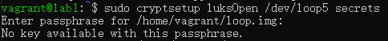
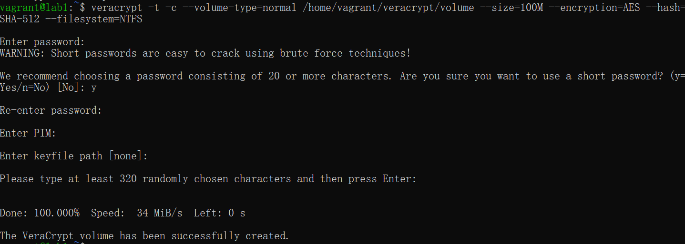
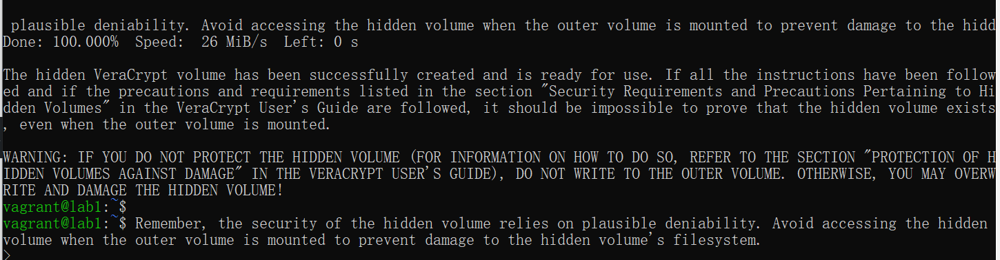

# A4 Encrypted Filesystems

## 1. Preparation

install necessary tools

```shell
    sudo apt update
    sudo apt -y install cryptsetup
    sudo apt -y install gnupg
    sudo apt -y install haveged
    sudo apt install -y gocryptfs
```

Enable dm_crypt and aes, disable cryptloop.

```shell
sudo modprobe dm_crypt
sudo modprobe aes
sudo modprobe -r cryptoloop
```

check if mods are correctly set up

```shell
lsmod | grep [mod name]
```

## 2. Encrypting a single file using GnuPG

> Let's start with a simple encryption using GPG. Begin by creating a GPG keypair on both lab1 and lab2 using the RSA algorithm and 2048 bit keys. Exchange (and verify) the public keys between lab1 and lab2.
>
> Create a plaintext file with some text in it on lab1. Encrypt the file using lab2's public key, and send the encrypted file to lab2. Now decrypt the file.
>
> Finally, sign a plaintext file on lab2, send the file with its signature to lab1. Verify on lab1 that it really was the lab2 user that signed the message.

### 2.1 What are the differences between stacked file system encryption and Block device encryption?

Stacked file system encryption operates at the file system level. It sits between the file system and the kernel, encrypting and decrypting files on-the-fly as they are written to or read from the storage device.

Block device encryption works at a lower level, encrypting the entire block device (such as a hard drive or partition). It operates beneath the file system, meaning the file system is unaware of the encryption.

### 2.2 Provide the commands you used for creating and verifying the keys and explain what they do

Full process of encrypt a file:

- lab1 uses lab2's public key to encrypt a file and send the encrypted file to lab2.
- lab2, receiving lab1's encrypted file, uses its own private key to decrypt the file

Generate keys for both lab1 and lab2, and user interactive mode to configure the key (name, email, comment)

```shell
gpg --full-generate-key
```

output public keyfile, `--armor` will output ascii-armored content.

```shell
gpg --armor --output lab1key.gpg --export vargrant@lab2
```

Then a `lab1key.gpg` and a `lab2key.gpg` will appear on lab1 and lab2 respectfully, copy the files to the other machine.

Sign the keys received from the other machine

```shell
gpg --edit-key vagrant@lab1
```

After signing the key, use the public key of the recipient to encrypt a file, output into test.gpg

```shell
gpg --output test.gpg --encrypt --recipient vagrant@lab2 test.txt
```

Upon receiving the file, use private key to decrypt the file.

```shell
gpg --output result.txt --decrypt test.gpg
```

Full process of sign a file

- On lab2, use a secret key to sign a file (signed.txt). A signed file will be generated (signed.txt.gpg).
- One can use verify the key using `--verify` option to output the signature info from the signed file

sign a file, use `--default-key` to set the default key to use. a `signed.txt.gpg` will be generated.

```shell
gpg --sign --default-key vagrant@lab2 signed.txt
```

Verify a file

```shell
gpg --verify signed.txt.gpg
```

Verification output

```shell
gpg: Signature made Mon Mar 11 12:23:53 2024 UTC
gpg:                using RSA key A20A8FA5028DD139E73F243919BD9526874AC8DC
gpg:                issuer "vagrant@lab2"
gpg: Good signature from "lab2key <vagrant@lab2>" [ultimate]
```

Decryption

```shell
gpg --output outsigned.txt --decrypt signed.txt.gpg
```

### 2.3 Are there any security problems in using GPG like this?

The initial exchange of public keys (from Lab1 to Lab2 and vice versa) needs to be done securely to prevent man-in-the-middle attacks.

The security of the encrypted communication also depends on the security of the devices and networks used by Lab1 and Lab2.

In case a private key is compromised or no longer in use, there should be a mechanism to revoke the key.

### 2.4 How does GPG relate to PGP?

PGP stands for "Pretty Good Privacy" and is a program that creates an encrypted, digital file of a message or document. The sender encrypts the file with a password and only the recipient can decrypt it with their own password

GPG, or GNU Privacy Guard, is an open-source implementation of PGP encryption. It is functionally similar to PGP, but is available for free and can be used on a wider range of devices.

PGP is more user-friendly and supports a wider range of cryptographic algorithms. Public key and a private key.

GPG is more powerful and supports digital signatures. Primary key pair and an additional sub key pair.

GPG is fully compatible with OpenPGP, which means it can encrypt and decrypt data in a way that is interoperable with other OpenPGP-compliant systems, including those using PGP.

### 2.5 What is haveged and why did we install it earlier? What possible problems can usage of haveged have?

Haveged is a software daemon that generates system entropy, which is used to feed the random number pool in Linux systems. Entropy is a measure of the randomness collected by an operating system, used for various security purposes, such as cryptographic operations, secure communications, and secure random number generation.

While haveged is designed to improve the randomness and availability of entropy, some security experts express concerns about the predictability and quality of the entropy it generates. If the randomness provided by haveged is not of high quality, it could potentially weaken cryptographic operations, making them more vulnerable to attacks.

Some argue that modern Linux kernels and hardware (like those with the RDRAND instruction on Intel CPUs) provide sufficient entropy without needing additional daemons like haveged, making it potentially unnecessary in some environments.

## 3. Crypto filesystem with loopback and device mapper

> Create a loopback device for the file using losetup(8). Then using cryptsetup(8), format the loopback device and map it to a pseudo-device. Please use LUKS with aes-cbc-essiv:sha256 cipher (should be default).
>
> Create an ext2 filesystem on the pseudo-device, created in the previous step. The filesystem can be created with mkfs.ext2(8).
>
> After this, you have successfully created an encrypted filesystem into a file. The filesystem is ready, and requires a passphrase to be entered when you luksOpen it.
>
> Now mount your filesystem. Create some files and directories on the encrypted filesystem. Check also what happens if you try to mount the system with a wrong key.

### 3.1 Provide the commands you used

Create a file with random data

```shell
dd if=/dev/urandom of=loop.img bs=1k count=32k
```

Find the first unused loopback device

```shell
losetup -f
```

Upon find the unused loopback device (/dev/loop5) in this case, associate loop.img with the loopback device.

```shell
sudo losetup /dev/loop5 loop.img
```

Format the loopback device with LUKS

```shell
sudo cryptsetup luksFormat /dev/loop5
```

Open the encrypted device with `cryptsetup` to map it to a pseudo-device. The device will be available as `/dev/mapper/sercrets`

```shell
sudo cryptsetup luksOpen /dev/loop5 secrets
```

Ceate an ext2 filesystem on the pseudo-device using `mkfs.ext2`.

```shell
mkfs.ext2 /dev/mapper/secrets
```

Mount the newly created ext2 filesystem to a mount point. Then the file system will be available at the mount point.

```shell
sudo mount /dev/mapper/secrets ~/mp
```

Unmount the filesystem and close the device

```shell
sudo umount ~/mp
cryptsetup close secrets
losetup -d /dev/loop5
```

Bad passphrase:



### 3.2 Explain the concepts of the pseudo-device and loopback device

A pseudo-device refers to a software abstraction that provides a device-like interface to the user or system, but doesn't correspond to any actual hardware device. It's a device driver or interface that emulates the behavior of a hardware device in software, allowing software and hardware to interact

Pseudo-devices are commonly used in operating systems to handle various system-level functionalities like random number generation, networking, and inter-process communication.

A loopback device is a specific type of pseudo-device that is used to mount a filesystem contained within a file. It makes a file accessible as a block device, upon which a filesystem can be mounted as if it were a physical disk. This is commonly used for mounting disk images to access the filesystems

### 3.3 What is LUKS

LUKS stands for Linux Unified Key Setup. It's essentially a standard for hard disk encryption used by Linux. It's designed to secure data on hard drives by encrypting the entire block devices, using a variety of encryption algorithms and modes. What makes LUKS stand out is its support for multiple user keys, meaning you can have different keys that unlock the same encrypted volume, which is useful for multi-user environments.

### 3.4 What is this kind of encryption method (creating a filesystem into a large random file, and storing a password protected decryption key with it) good for? What strengths and weaknesses does it have?

By encrypting the entire filesystem or a large file that acts as a virtual disk, it ensures that all data stored within is protected from unauthorized access.

Users can interact with the encrypted filesystem as if it were a regular filesystem. This transparency simplifies the user experience while maintaining security.

While the data is encrypted and secure when the system is off or the volume is locked, once mounted and unlocked, the data is accessible to any process or user with sufficient permissions on the system. This doesn't protect against attacks when the system is running.

Encryption and decryption processes add computational overhead

If the decryption key is lost or corrupted, and no backup key is available, the data stored within the encrypted volume becomes irrecoverable.

### 3.5 Why did we remove cryptoloop from the assignment and replaced it with dm_crypt? Extending the question a bit, what realities must a sysadmin remember with any to-be-deployed and already deployed security-related software?

Cryptoloop was susceptible to watermarking attacks, a form of cryptographic attack where unique patterns (watermarks) are embedded into encrypted data. These patterns can sometimes be detected without decrypting the data, potentially leaking information about the encrypted contents.

Cryptoloop didn't include any mechanism for authenticating the encrypted data. This meant that it was not possible to verify whether the data had been changed.

Cryptoloop stored encryption metadata in a header that was not itself encrypted or authenticated. This made it possible for an attacker to manipulate the encryption header

---

Security software must be kept up-to-date to protect against the latest threats and vulnerabilities.

Not all security tools are suitable for every situation. Sysadmins need to understand the specific threats they are trying to mitigate and choose tools that effectively address those threats.

Sysadmins must have a disaster recovery plan that includes secure backups

Security measures can impact system performance.

## 4. Gocryptfs

> Using gocryptfs, mount an encrypted filesystem on a directory of your choice. This gives you the encryption layer. After this, create a few directories, and some files in them. Unmount gocryptfs using Fuse's fusermount.
>
> Check what was written on the file system.

### 4.1 Provide the commands you used

Create a directory and init a gocryptfs filesystem

```shell
gocryptfs -init ~/goencrypt
```

Create a directory to mount the encrypted directory

```shell
gocryptfs ~/goencrypt ~/mp/gocryptfs
```

Unmount the directory

```shell
fusermount -u ~/mp/gocryptfs
```

### 4.2 Explain how this approach differs from the loopback one. What are the main differences between gocryptfs and encFS? Is encFS secure?

Loopback encryption works at the block device level, encrypting entire disk partitions or files treated as block devices. In contrast, gocryptfs operates at the file level, encrypting individual files within a mounted directory.

gocryptfs and EncFS are both file-based encryption systems that operate in user space using FUSE. However, they have some differences:

Go cryptfs Much faster read speed.

EncFS is probably safe as long as the adversary only gets one copy of the ciphertext and nothing more. EncFS is not safe if the adversary has the opportunity to see two or more snapshots of the ciphertext at different times. EncFS attempts to protect files from malicious modification, but there are serious problems with this feature.

If the attacker can see the changes over time, then they get even more information. They can see which files change and how often, whether the changes influence the file size, and so on. In some cases they can even tell roughly which part of the file was changed.

## 5. TrueCrypt and alternatives

> On this course we used to have a TrueCrypt assignment where students were required to create a hidden volume inside another volume. However, since 2014 there has been a lot of discussion about the security of TrueCrypt. Read arguments against and for TrueCrypt and based on your knowledge of the subject make a choice to use either TrueCrypt or one of the alternative forks that can create hidden volumes. Using the software of your choice create a hidden volume within an encrypted volume.
>
> If you decide to use veracrypt, the command line syntax for veracrypt is
>
> ```shell
> veracrypt [OPTIONS] VOLUME_PATH [MOUNT_DIRECTORY]
> ```
>
> and the options can be found by running
>
> ```shell
> veracrypt -h
> ```

### 5.1 Which encryption software did you choose and why?

TrueCrypt development officially ended in May 2014. Since then, no new features or security updates have been released for TrueCrypt. VeraCrypt, on the other hand, is actively maintained, which means it receives regular updates, security enhancements, and bug fixes.

VeraCrypt entered the scene as a fork of TrueCrypt and aimed to address its predecessor's security issues.

### 5.2 Provide the commands that you used to create the volumes. Demonstrate that you can mount the outer and the hidden volume

Create a encrypted volume





### 5.3 What is plausible deniability

Plausible deniability in the context of encrypted volumes, particularly with technologies like VeraCrypt, refers to the ability to deny the existence of encrypted data convincingly. This concept is crucial for protecting sensitive information even under duress, such as when someone is forced to reveal their encryption keys.
