# A5 Firewall

## 1. Preparation

If you are doing both paths, you might want to consider making new virtual machines for this exercise, because the two assignments might cause some conflicts or problems.

You will need all three virtual machines for this exercise. Lab1 functions as a router/firewall between lab2 and lab3, which are in different subnetworks. The enp0s3 interface allows access to the virtual machines. Be careful not to modify it or block access to it. Make sure you are not sending packets through enp0s3 when connecting to other virtual machines, because that way you will bypass the firewall. The communication between VMs should be through the internal networks.

Please remember to take backups of the folders you have modified on the virtual machines.

## 2. Setup up

### 2.1 Explain commands

Add the necessary route to allow the machines to reach each other through lab1.

On lab3

```shell
sudo ip route add 192.168.0.0/24 via 192.168.2.3 dev enp0s8
```

On lab2

```shell
sudo ip route add 192.168.2.0/24 via 192.168.0.3 dev enp0s8
```

On lab1

```shell
sudo sysctl -w net.ipv4.conf.enp0s8.forwarding=1
sudo sysctl -w net.ipv4.conf.enp0s9.forwarding=1
sudo sysctl -w net.ipv4.conf.enp0s8.proxy_arp=1
sudo sysctl -w net.ipv4.conf.enp0s9.proxy_arp=1
```

traceroute results

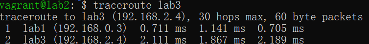

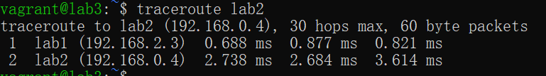

### 2.2 Explain tables, chains, hooks and rules in nftables?

nftables Overview

nftables is a Linux kernel packet classification framework that has replaced iptables, providing a new syntax for defining firewall rules. It offers a more consistent and flexible way of managing network packets for filtering, NAT, and other packet mangling. nftables uses a different terminology and structure for its configuration, which includes tables, chains, hooks, and rules. Let's explore each of these components:

Tables

Tables in nftables are the containers for holding chains. Think of tables as databases that house different sets of rules and chains for specific purposes. Tables can be associated with a family, which determines the type of packets the table can handle. The most commonly used families are `ip` for IPv4, `ip6` for IPv6, `inet` for both IPv4 and IPv6, `arp`, and `bridge`. A single table can contain multiple chains, and you define tables for specific tasks like filtering, NAT, or other packet processing functions.

Chains

Chains are sequences of rules that reside within a table. When packets are processed by nftables, they traverse through these chains. Chains are linked to hooks in the networking stack, determining when the chain's rules should be evaluated against incoming or outgoing packets. There are five predefined chain types in nftables:

1. **Filter**: Used for packet filtering (allowing or blocking).
2. **NAT**: For network address translation tasks.
3. **Route**: Used to alter the packet's route.
4. **Mangle**: For specialized packet alterations.
5. **Queue**: Directs packets to user space (from kernel space).

Chains can be set to have a default policy, such as `accept`, `drop`, or `reject`, which is applied if no rule in the chain matches the packet.

Hooks

Hooks are points in the network stack where chains can be attached to filter or modify packets. They define the stage at which the chain should be evaluated. The common hooks in the Linux networking stack are:

1. **Prerouting**: For packets as they just arrive on the network interface.
2. **Input**: For packets destined for the local system.
3. **Forward**: For packets being routed through the system.
4. **Output**: For locally-generated packets before they are sent out.
5. **Postrouting**: For packets as they are about to leave the system.

By attaching a chain to a specific hook, you determine at what point in the packet processing pipeline the rules within that chain are evaluated.

Rules

Rules are the individual conditions or actions that are applied to packets within a chain. Each rule in a chain is evaluated in sequence against incoming or outgoing packets. A rule consists of two main parts:

1. **Match conditions**: Criteria that a packet must meet for the rule to be applied. This can include attributes like source/destination IP addresses, port numbers, protocol types, and more.
2. **Statements**: Actions to take when a packet matches the conditions. Common actions include `accept`, `drop`, `reject`, `log`, or even jumping to another chain for further processing.

Rules are the core of nftables' functionality, allowing fine-grained control over how packets are handled based on a wide variety of criteria.

In summary, nftables organizes its firewall rules within a structured framework of tables and chains, utilizing hooks to determine the points in the packet processing pathway where those chains are applied, and defines rules within those chains to match and process packets according to specific criteria.

## 3 Implement packet filtering on the router

### 3.1 List the services that were found scanning the machines with and without the firewall active. Explain the differences in how the details of the system were detected

from lab2 to lab3 without firewall
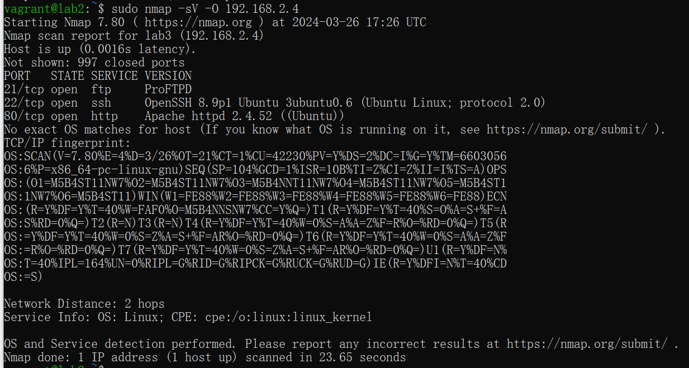

from lab3 to lab2 without firewall
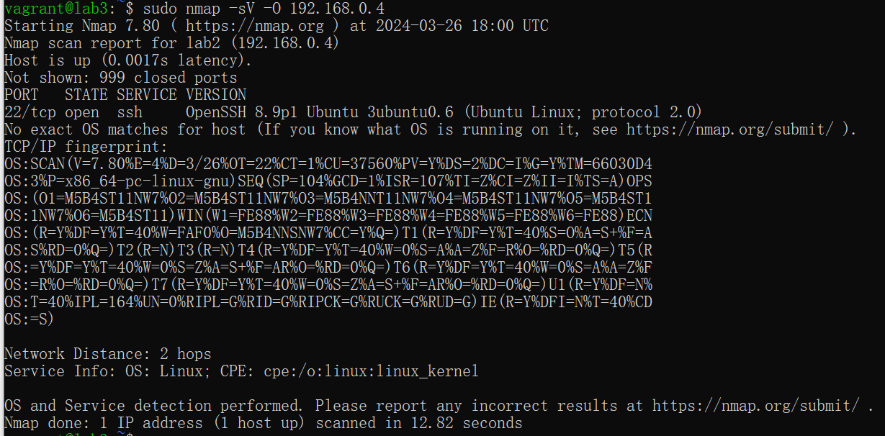

The nmap scans from lab2 to lab3 (and vice versa) show open ports and services such as FTP (ProFTPD), SSH (OpenSSH), and HTTP (Apache HTTPd). This indicates that there were no firewall rules to block or filter the traffic between these hosts.

from lab3 to lab2 with firewall
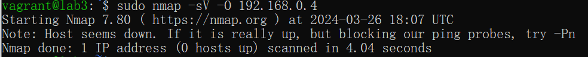

from lab2 to lab3 with firewall
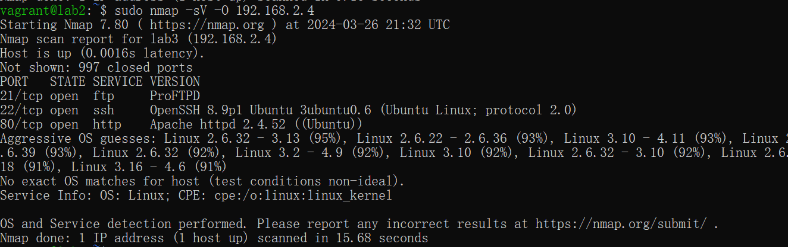

These rules allow pinging from lab3 to lab2 (enp0s8) and the responses back. However, because there is no similar rule for enp0s9, ICMP requests from lab2 to lab3 are dropped, which matches the "host seems down" response.

The rules explicitly allow new and established connections for SSH and FTP from and to lab2, which explains why these services are detected in the scan from lab3.

Traffic on port 80 is allowed if it is in the established state. Since nmap from lab3 would initiate a connection that becomes established, responses from lab2 are allowed back through.

These are typically used for ephemeral ports, often by client-side of TCP connections. By allowing this traffic from enp0s9, it permits responses to outbound connections initiated by lab3.

### 3.2 List the commands used to implement the ruleset with explanations

Set up an nftables(8) FORWARD policy to disallow traffic through the router by default. Add rules to allow ping(8) from lab2 on the enp0s8 interface and replies to lab2. Change rules only for the FORWARD hook!

```shell
sudo nft flush ruleset
sudo nft add table ip filter
sudo nft add chain ip filter forward { type filter hook forward priority 0 \; policy drop \; }
sudo nft add rule ip filter forward iifname "enp0s8" ip saddr 192.168.0.4 icmp type echo-request accept
sudo nft add rule ip filter forward oifname "enp0s8" ip daddr 192.168.0.4 icmp type echo-reply accept
sudo nft add rule ip filter forward ct state related,established accept
```

Once this is working, expand the ruleset to allow SSH connections to and from lab2. Also allow browsing the web and transferring files via FTP (both active and passive modes) from lab2. Use as restricting ruleset as possible while allowing full functionality. You will probably need the "ip_conntrack_ftp" kernel module for FTP filtering. Load it with modprobe(8).

```shell
#incoming ssh
sudo nft add rule ip filter forward iifname "enp0s8" tcp dport 22 ip saddr 192.168.0.4 accept
#outgoing ssh
sudo nft add rule ip filter forward oifname "enp0s8" tcp sport 22 ip daddr 192.168.0.4 accept

# allow http https
sudo nft add rule ip filter forward oifname "enp0s8" ip saddr 192.168.0.4 tcp dport { 80, 443 } accept

# Allow FTP Transfers
# enable mode
sudo modprobe ip_conntrack_ftp
# Allow FTP control connection
sudo nft add rule ip filter forward oifname "enp0s8" ip saddr 192.168.0.4 tcp dport 21 accept
# In active mode, the server (outside) will initiate connections to the client (lab2), so you need to allow incoming connections to high ports (above 1023) from the FTP server
sudo nft add rule ip filter forward iifname "enp0s8" ip saddr 192.168.0.4 tcp sport 1024-65535 accept
# In passive mode, the client (lab2) will initiate connections to the server's high ports, so you need to allow outgoing connections to high ports
sudo nft add rule ip filter forward oifname "enp0s8" ip saddr 192.168.0.4 tcp dport 1024-65535 accept
```

adds a rule to the forward chain of the filter table that allows all packets that are part of an established connection, or related to an established connection, to be forwarded through the host.

```shell
sudo nft add rule ip filter forward ct state related,established accept
```

check

```shell
sudo nft list ruleset
```

Final ruleset

```text
table ip filter {
        chain forward {
                type filter hook forward priority filter; policy drop;
                iifname "enp0s8" ip saddr 192.168.0.4 icmp type echo-request accept
                oifname "enp0s8" ip daddr 192.168.0.4 icmp type echo-reply accept
                ct state established,related accept
                iifname "enp0s8" tcp dport 22 ip saddr 192.168.0.4 accept
                oifname "enp0s8" tcp sport 22 ip daddr 192.168.0.4 accept
                oifname "enp0s8" ip saddr 192.168.0.4 tcp dport { 80, 443 } accept
                oifname "enp0s8" ip saddr 192.168.0.4 tcp dport 21 accept
                iifname "enp0s8" ip saddr 192.168.0.4 tcp sport 1024-65535 accept
                oifname "enp0s8" ip saddr 192.168.0.4 tcp dport 1024-65535 accept
                ct state established,related accept
        }
}
```

### 3.3 Create a few test cases to verify your ruleset. Run the tests and provide minimal, but sufficient snippets of logs to support your test results, including dropping unallowed cases

SSH On lab2

```shell
ssh vagrant@lab3
```

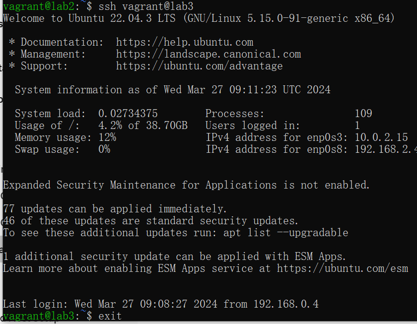

HTTP On lab2

```shell
curl -i lab3
```

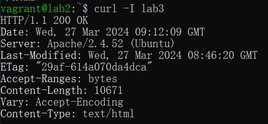

FTP On lab2

```shell
ftp lab3
```
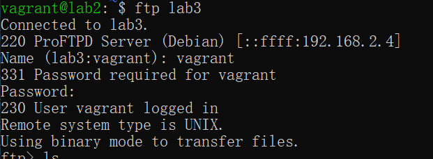

Block On lab2

```shell
nc -zv 192.168.2.4 50000
```


### 3.4 Explain the difference between netfilter DROP and REJECT targets. Test both of them, and explain your findings

DROP: When a rule uses the DROP target, packets that match the rule are silently discarded. The packet is simply dropped with no indication given back to the sender. This can make it seem as if the packet has been lost in transit or the destination is unreachable due to a network issue.

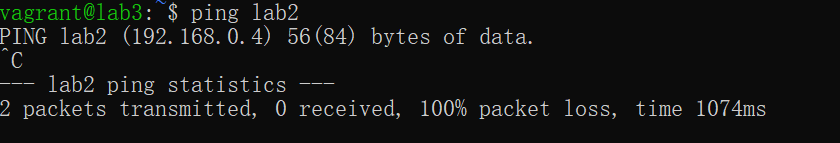

REJECT: The REJECT target, on the other hand, not only stops the packet but also sends back an error message to the sender. The default error message is usually an ICMP "port unreachable" error, but this can be customized. The sender thus knows that the packet was explicitly rejected by a firewall rule.

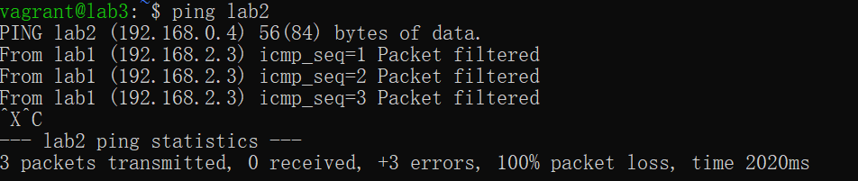

## 4. Implement a web proxy

> In addition to packet filtering, a proxy can be used to control traffic. In this step, you will set up a web proxy and force all http traffic to go through the proxy, where more detailed rules can be applied.
>
> Connect from lab2 to the HTTP server running on lab3 and capture the headers of the response.
> On lab1, configure a squid(8) web proxy to serve only requests from lab2 as a transparent proxy.
> Configure the firewall on lab1 to send all TCP traffic from lab2 bound to port 80 to the squid proxy.
> Connect to the HTTP server on lab3 again and capture the headers of the response.
> Finally, configure the proxy not to serve pages from lab3 and attempt to retrieve the front page.

### 4.1 List the commands you used to send the traffic to the proxy with explanations

send http request and get header

From lab2

```shell
curl -I http://lab3
```
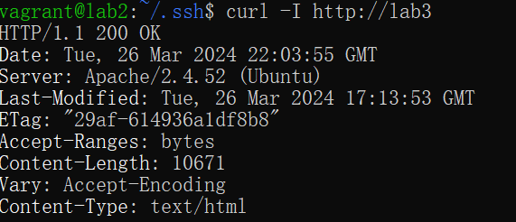

Squid conf and restart the squid service

```text
http_port 3111 intercept
acl lab2 src 192.168.0.4
http_access allow lab2
http_access deny all
```

Configure lab1's firewall to redirect all outgoing TCP traffic destined for port 80 to Squid's listening port (which is set to 3111)

```shell
sudo iptables -t nat -A PREROUTING -i enp0s8 -p tcp --dport 80 -j REDIRECT --to-port 3111
```

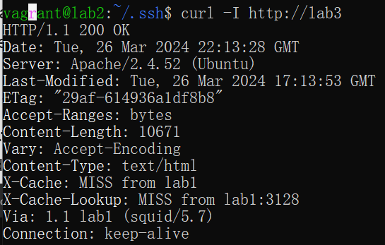


Configure Squid to Block Pages from lab3 and try curl -I lab3 again.

```text
acl lab3 dstdomain lab3-ip-address
http_access deny lab2 lab3
```

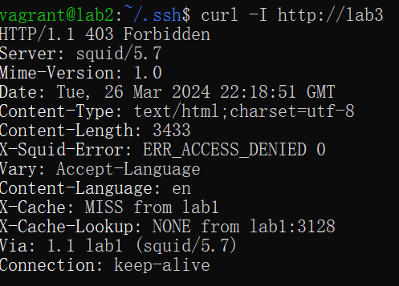

### 4.2


### 4.3 What is a transparent proxy?

A transparent proxy can be installed without your knowledge and without any software or configurations on your part. It is also referred to as a "forced proxy" because it can be put in place by a webmaster or an internet service provider (ISP) without users knowing.

Transparent proxies serve as a conduit between clients and the internet, intercepting connections.

When a transparent proxy is used, a user’s actual IP address is made public in the HTTP header. Such a proxy only verifies and identifies your connection; it does not protect or modify your IP address.

### 4.4 List the differences in HTTP headers after setting up the proxy. What has changed?

X-Cache: This header is often used by caching proxies (like Squid) to indicate whether a response was served from the cache (X-Cache: HIT) or forwarded to the origin server (X-Cache: MISS).

X-Cache-Lookup: Similar to X-Cache, this header shows whether a cache lookup was successful (X-Cache-Lookup: HIT) or not (X-Cache-Lookup: MISS).

Via: This header is added by proxies to track the request chain. It helps in identifying the protocol and proxies through which the request has passed. After setting up a transparent proxy, you might see an entry like Via: 1.1 proxy-server-name (squid/3.5.20) indicating that the request was routed through a Squid proxy.


## 5.

```shell

table inet firewall {
    # Define your chains
    chain input {
        type filter hook input priority 0; policy accept;
    }

    chain forward {
        type filter hook forward priority 0; policy drop;

        # Allow established connections
        ct state established,related accept

        # 4. Allow traffic from enp0s9 (Internal) to enp0s8 (DMZ)
        iifname "enp0s9" oifname "enp0s8" accept

        # 5. Allow traffic from enp0s8 to enp0s9 only in response to requests
        iifname "enp0s8" oifname "enp0s9" ct state established,related accept
    }

    chain output {
        type filter hook output priority 0; policy accept;
    }

    # 2. DNAT rule for redirecting port 8080 to port 80 on lab2
    chain prerouting {
        type nat hook prerouting priority -100;

        # Redirect incoming packets on port 8080 to lab2's port 80
        iifname "enp0s3" tcp dport 8080 dnat to 192.168.0.4:80;
    }

    # 3. Masquerade outgoing traffic
    chain postrouting {
        type nat hook postrouting priority 100;

        # Masquerade packets leaving the host
        masquerade
    }
}
```


