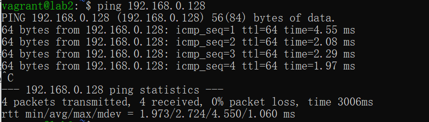
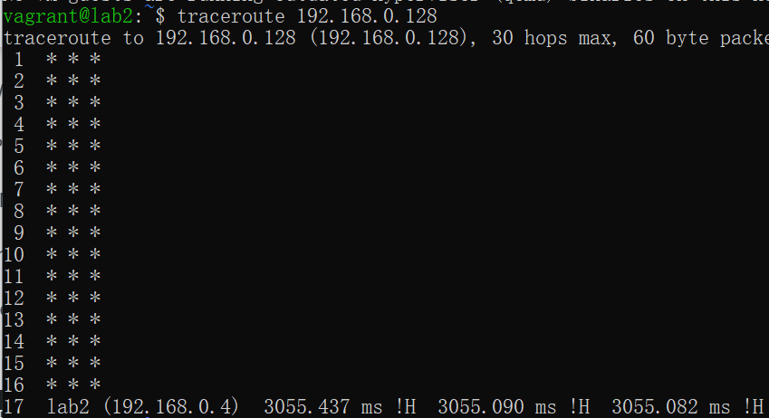
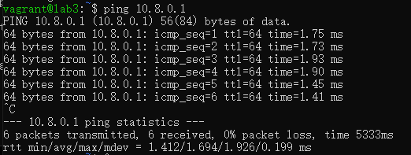
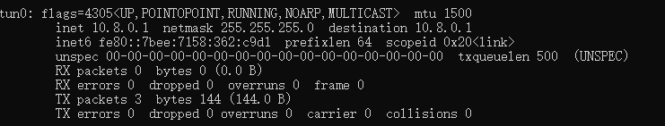

# B5 VPN

## 1. Initial Setup

> Install openvpn package for GW and RW if it has not been preinstalled. Install also bridge-utils for GW.
>
> On lab1 (GW):
>
> Assign a static IP from the subnet 192.168.0.0/24 to the interface enp0s8
> Assign a static IP from the subnet 192.168.2.0/24 to the interface enp0s9
> On lab2 (SS):
>
> Assign a static IP from the subnet 192.168.0.0/24 to the interface enp0s8
> On lab3 (RW):
>
> Assign a static IP from the subnet 192.168.2.0/24 to the interface enp0s8
> In this exercise, the enp0s3 interfaces are only used for SSH remote access. Do not use them for any other traffic. Verify that you can ping the gateway from the other hosts, and that you can not ping the RW from the SSor vice versa. Write down the network configuration.

### 1.1 Present your network configuration. What IPs did you assign to the interfaces (4 interfaces in all) of each of the three hosts?

The answer is in the vagrant file

## 2. Setting up a PKI (Public Key Infrastructure)

> The first step in establishing an OpenVPN connection is to build the public key infrastructure (PKI).
>
> You'll need to generate the master Certificate Authority (CA) certificate/key, the server certificate/key and a key for at least one client. In addition you also have to generate the Diffie-Hellman parameters for the server. Note: the Ubuntu openvpn package no longer ships with easy-rsa.
>
> After you have generated all the necessary certificates and keys, copy the necessary files (securely) to the road warrior (RW) host.

### Setup procedure

install openvpn and easyrsa

```shell
sudo apt update
sudo apt install easy-rsa
```

Copy the Easy-RSA template files into this directory

```shell
make-cadir ~/openvpn-ca
cd ~/openvpn-ca
```

edit `vars` file in `~/openvpn-ca`

```shell
set_var EASYRSA_REQ_COUNTRY    "FI"
set_var EASYRSA_REQ_PROVINCE   "Capital"
set_var EASYRSA_REQ_CITY       "Espoo"
set_var EASYRSA_REQ_ORG        "Copyleft Certificate Co"
set_var EASYRSA_REQ_EMAIL      "vagrant@lab1.com"
set_var EASYRSA_REQ_OU         "Aalto University"
```

Build Certificate Authority(CA)

```shell
cd ~/openvpn-ca
./easyrsa init-pki
./easyrsa build-ca
```

Generate the Server Certificate and Key

```shell
cd ~/openvpn-ca
./easyrsa gen-req server nopass
./easyrsa sign-req server server
```

Generate Client Certificate and Key

```shell
cd ~/openvpn-ca
./easyrsa gen-req client1 nopass
./easyrsa sign-req client client1
```

Generate Diffie-Hellman Parameters

```shell
cd ~/openvpn-ca
./easyrsa gen-dh
```

Copy these files to server

ca.crt
server.crt
server.key
dh.pem (Diffie-Hellman file, might be named dh2048.pem or similar)

Copy these files to client

ca.crt
client1.crt
client1.key

### 2.1 What is the purpose of each of the generated files? Which ones are needed by the client?

In a Public Key Infrastructure (PKI) setup for OpenVPN, various cryptographic files are generated for security and authentication purposes. Each file has a specific role in ensuring secure communication between the VPN server and clients. Here's a breakdown of the purpose of each generated file and which ones are needed by the client:

Certificate Authority (CA) Certificate (`ca.crt`)

- **Purpose**: The CA certificate is the root certificate for the PKI. It is used to sign other certificates in the infrastructure, establishing a chain of trust. Any certificate signed by the CA is considered valid by parties that trust the CA.
- **Needed by**: Both the server and clients need the CA certificate to verify each other's certificates.

Server Certificate (`server.crt`) and Key (`server.key`)

- **Purpose**: The server certificate, signed by the CA, is presented by the VPN server during the TLS handshake to prove its identity to the clients. The server key is the private key corresponding to the server certificate and is used for decryption and signing during the secure communication.
- **Needed by**: Only the server needs the server certificate and key. They should be kept secure and private, especially the key.

Client Certificate (`client1.crt`) and Key (`client1.key`)

- **Purpose**: Similarly, each client has its own certificate and key pair, also signed by the CA. The client certificate is used to authenticate the client to the server, and the client key is used for decryption and signing on the client side.
- **Needed by**: Each client needs its own certificate and key. Like the server key, the client keys must be kept secure and private.

Diffie-Hellman Parameters (`dh.pem`)

- **Purpose**: The Diffie-Hellman parameters are used to securely establish a shared secret over an insecure channel during the initial key exchange between the server and clients. This process is part of setting up a secure encrypted channel.
- **Needed by**: Only the server needs the Diffie-Hellman parameters file.

Client side

- **CA Certificate (`ca.crt`)**: To verify the server's certificate.
- **Client Certificate (`client1.crt`)**: To authenticate itself to the server.
- **Client Key (`client1.key`)**: To establish a secure encrypted connection with the server.

When setting up an OpenVPN client, ensure that the client configuration file (`client.ovpn` or similar) references these required files correctly. The paths to the CA certificate, client certificate, and client key should be specified in the configuration so that the OpenVPN client can use them for authentication and encryption.

### 2.2 Is there a simpler way of authentication available in OpenVPN? What are its benefits/drawbacks?

Static Key Authentication

A single static key is generated and securely shared between the server and client.
The same key is used for both encryption and decryption of traffic, as well as for authentication purposes.

Benefits:

- Simplicity: The setup is much simpler and faster than setting up a full PKI, requiring only a single key file to be shared between the server and client.
- Ease of Use: There are fewer configuration files to manage, making it easier for non-technical users or for quick deployments.
- Suitable for Point-to-Point Connections: Ideal for simple, static point-to-point VPNs without the need for scaling or managing multiple clients.

Drawbacks:

- Security Risks: Using a single key for both encryption and authentication is less secure than PKI-based methods. If the key is compromised, both the encryption and the authentication can be bypassed.
- Lack of Scalability: Each pair of devices requires a unique static key. Managing these keys becomes cumbersome as the number of connections grows.
- No Revocation Mechanism: There's no simple way to revoke access other than changing the static key and redistributing it, which must be done securely.
- Limited Functionality: Features like per-client rules, access control, and more complex networking setups are harder to implement without individual client certificates

## 3. Configuring the VPN server

> On GW copy /usr/share/doc/openvpn/examples/sample-config-files/server.conf.gz to for example /etc/openvpn and extract it. You have to edit the server.conf to use bridged mode with the correct virtual interface. You also have to check that the keys and certificates point to the correct files. Set the server to listen for connection in GW's enp0s9 IP address.
>
> Start the server on GW with openvpn server.conf

### 3.1 List and give a short explanation of the commands you used in your server configuration

For bridge setup:

Copy the `/usr/share/doc/openvpn/examples/sample-scripts/bridge_start` and `/usr/share/doc/openvpn/examples/sample-scripts/bridge_stop` to `/etc/openvpn`

Edit `bridge_start`

```text
# Define Bridge Interface
br="br0"

# Define list of TAP interfaces to be bridged,
# for example tap="tap0 tap1 tap2".
tap="tap0"

# Define physical ethernet interface to be bridged
# with TAP interface(s) above.
eth="enp0s8"
eth_ip="192.168.0.3"
eth_netmask="255.255.255.0"
eth_broadcast="192.168.0.255"

...
rest reamains the same
```

Edit `bridge_stop`

```text
# Define Bridge Interface
br="br0"

# Define list of TAP interfaces to be bridged together
tap="tap0"

ifconfig $br down
brctl delbr $br

for t in $tap; do
    openvpn --rmtun --dev $t
done
```

Copy `/usr/share/doc/openvpn/examples/sample-config-files/server.conf` to `/etc/openvpn` and edit it.

- Comment out the line which says dev tun and replace it instead with `dev tap0`
- Comment out the line that begins with server and replace it with `server-bridge 192.168.0.4 255.255.255.0 192.168.0.128 192.168.0.254`

### 3.2 What IP address space did you allocate to the OpenVPN clients?

### 3.3 Where can you find the log messages of the server by default? How can you change this?

OpenVPN, by default, sends its log messages to the syslog on Linux systems, which is accessible via the /var/log/syslog file. This behavior allows for a unified logging mechanism where system and application logs are consolidated

How to change

```shell
log /var/log/openvpn.log
```

or

```shell
log-append /var/log/openvpn.log
```

## 4. Bridging setup

Next you have to setup network bridging on the GW. We'll combine the enp0s8 interface of the gateway with a virtual TAP interface and bridge them together under an umbrella bridge interface.

OpenVPN provides a script for this in /usr/share/doc/openvpn/examples/sample-scripts . Copy the bridge-start and the bridge-stop scripts to a different folder for editing. Edit the parameters of the script files to match with GW's enp0s8. Start the bridge and check with ifconfig that the bridging was successful.

### 4.1 Show with ifconfig that you have created the new interfaces (virtual and bridge). What's the IP of the bridge interface


### 4.2 What is the difference between routing and bridging in VPN? What are the benefits/disadvantages of the two? When would you use routing and when bridging

#### Routing

In a VPN context, routed connections typically use `tun` devices (network tunnel interfaces) and operate at the OSI model's Layer 3 (Network layer).
The VPN server acts as a router that connects two or more distinct networks, making decisions about where to send packets based on routing tables.

Advantages: Routing can handle large networks efficiently because it doesn't need to broadcast all network traffic everywhere, reducing unnecessary data transmission. It allows for complex topologies and can easily segment network traffic, enhancing security and organizational clarity.

Disadvantages: Not all network protocols are routable. For example, non-IP protocols can't be routed over a VPN configured in routing mode.

#### Bridging

In a VPN, bridging often uses tap devices (Ethernet tunnel interfaces), allowing non-IP protocols to pass through and making remote devices appear as if they are on the same local network.

Advantages: Can transport any network protocol that works over Ethernet, including non-IP protocols. For small networks, bridging can be simpler to configure, as it doesn't require setting up routing tables or network segments. Remote clients appear to be directly connected to the main network, making resource sharing (like file services and printers) straightforward.

Disadvantages: Since it simulates a single Ethernet network, all broadcast traffic is propagated over the VPN, which can lead to inefficiency, especially in larger setups. Less scalable than routed networks because of the increased overhead of broadcast traffic.

## 5. Configuring the VPN client and testing connection

> On RW copy /usr/share/doc/openvpn/examples/sample-config-files/client.conf to for example /etc/openvpn. Edit the client.conf to match with the settings of the server. Remember to check that the certificates and keys point to the right folders.
>
> Connect RW to the server on GW with openvpn client.conf. Pinging the SSfrom RW should now work.
>
> If you have problems with the ping not going through, go to VirtualBox network adapter settings and allow promiscuous mode for internal networks that need it.

### 5.1 List and give a short explanation of the commands you used in your VPN client configuration





### 5.2 Demonstrate that you can reach the SS from the RW. Setup a server on the client with netcat and connect to this with telnet/nc. Send messages to both directions

### 5.3 Capture incoming/outgoing traffic on GW's enp0s9 or RW's enp0s8. Why can't you read the messages sent in 5.2 (in plain text) even if you comment out the cipher command in the config-files?

OpenVPN has a default cipher (as of OpenVPN 2.4, it's AES-256-GCM) that it will fall back on if no cipher is explicitly specified. This means that the traffic between the SS and RW over the VPN tunnel is still encrypted.

### 5.4 Enable ciphering. Is there a way to capture and read the messages sent in 5.2 on GW despite the encryption? Where is the message encrypted and where is it not?

sudo tcpdump -i enp0s8 port 12345 -A

If the GW is configured as an OpenVPN endpoint (which it seems to be in your setup), theoretically, you could configure it to decrypt traffic for inspection. However, this would typically be considered a man-in-the-middle (MITM) attack and is not recommended for ethical and security reasons. It would also require significant changes to your VPN configuration and potentially compromise the security and privacy of the VPN users.

Some advanced firewall and security appliances offer SSL/TLS inspection features, which involve decrypting, inspecting, and then re-encrypting traffic. However, this requires installing a trusted root certificate on all client devices, effectively conducting a controlled MITM attack. This approach is used in some corporate environments for data loss prevention and monitoring but is generally not suitable for secure, privacy-focused VPNs.

Inside the VPN tunnel (between RW and SS through GW): Encrypted, unreadable.
At the endpoints (before entering or after leaving the VPN tunnel on RW or SS): Unencrypted, readable with the right tools and access.

### 5.5 Traceroute RW from SS and vice versa. Explain the result


## 6. Setting up routed VPN

> In this task, you have to set up routed VPN as opposed to the bridged VPN above.  Stop openvpn service on both server and client.
>
> 1. Reconfigure the server.conf and the client.conf to have routed vpn.
>
> 2. Restart openvpn service on both server and client.
>
> 3. Now you should be able to ping virtual IP address of vpn server from client.

### 6.1 List and give a short explanation of the commands you used in your server configuration

Template files, cp them to `/etc/openvpn`

```text
Server: /usr/share/doc/openvpn/examples/sample-config-files/server.conf
Client: /usr/share/doc/openvpn/examples/sample-config-files/client.conf
```




### 6.2 Show with ifconfig that you have created the new virtual IP interfaces. What's the IP address?

